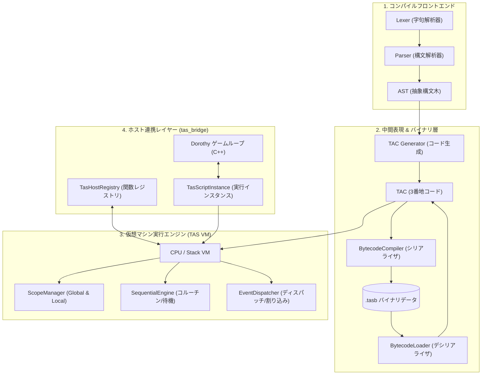
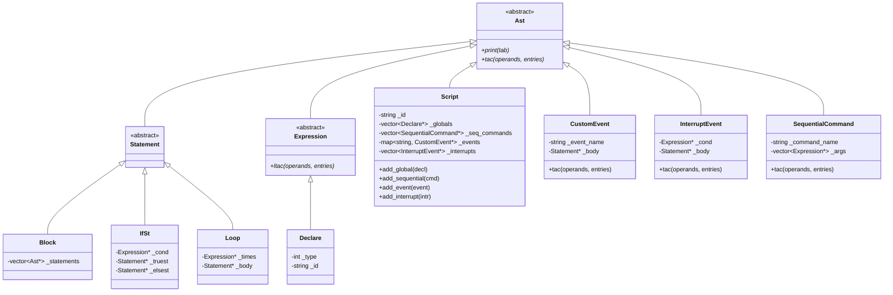
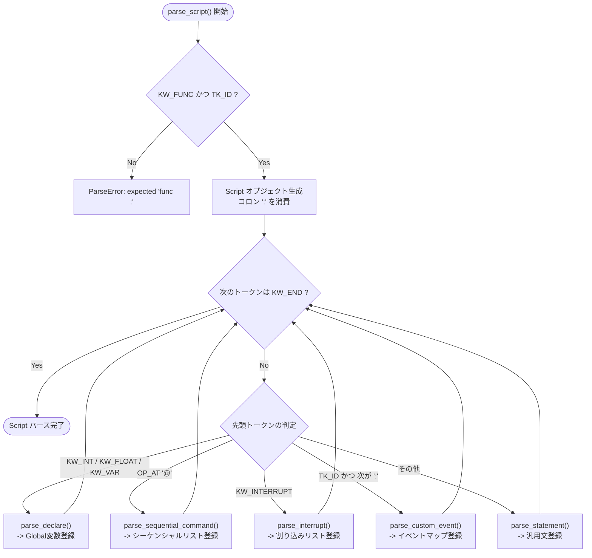
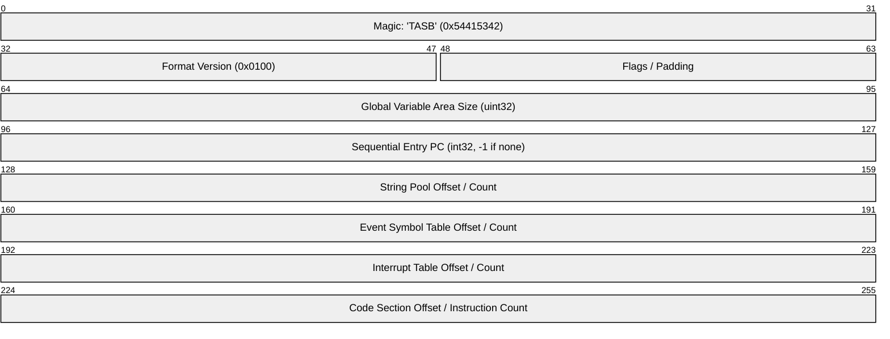
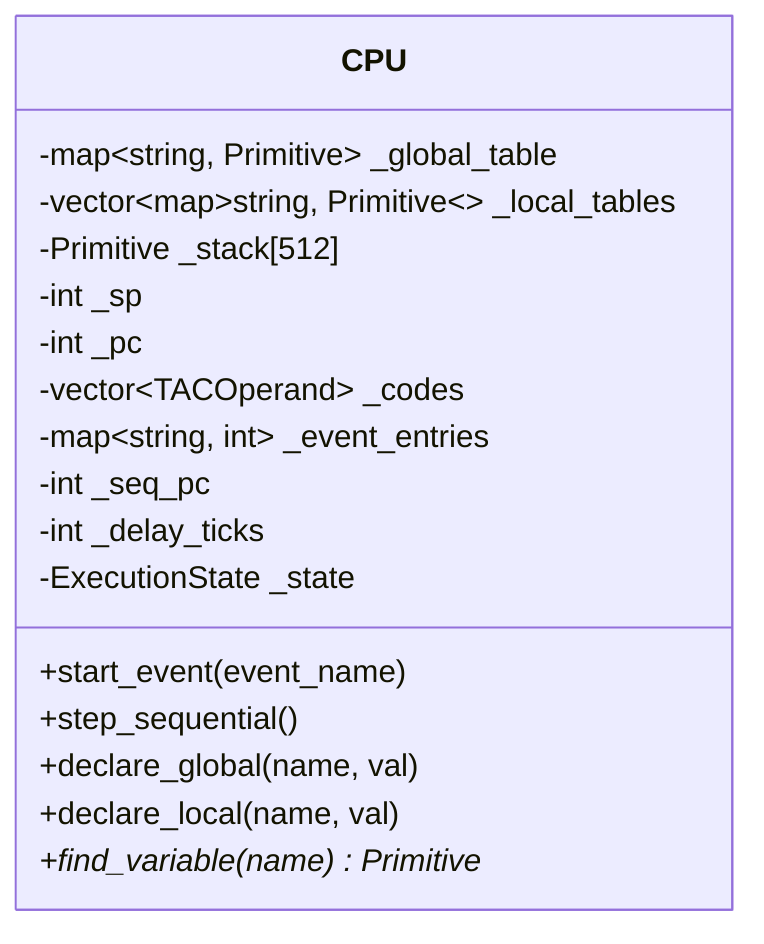
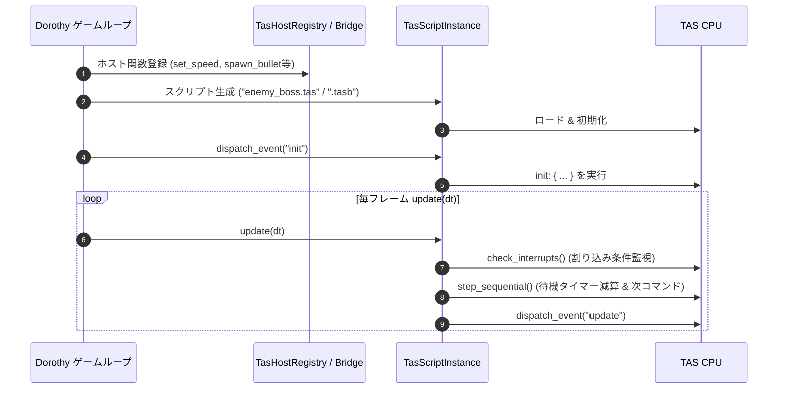
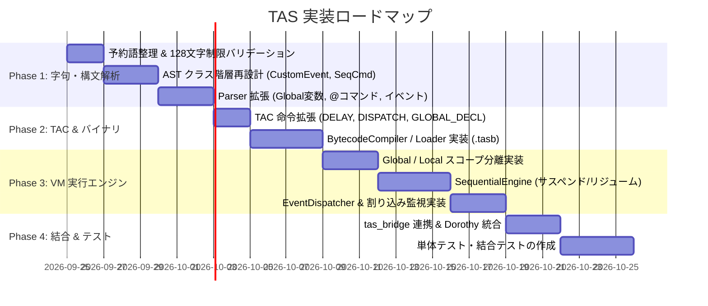

# Tombee Action Script (TAS) 実装詳細設計書 (Implementation Design Document)

本書は、[SPEC.md](SPEC.md) で定義された Tombee Action Script (TAS) の言語仕様を C++ コードベースにおいて実現するための実装詳細設計書です。

---

## 1. 全体アーキテクチャ & モジュール構成

TAS のシステムは、コンパイルフロントエンド、中間表現/バイナリ層、仮想マシン実行エンジン、およびホスト連携ブリッジの4つの主要レイヤーで構成されます。



---

## 2. 字句解析器 (Lexer) & 構文解析器 (Parser) 設計

### 2.1 トークン定義の改修 (`token.hpp`)

`init`, `update`, `render` を予約語から除外し、一般的な識別子 (`TK_ID`) としてトークン化します。また、シーケンシャルコマンド記号 `@` をサポートします。

```cpp
namespace tas {

struct Token {
    enum TokenType {
        TK_EOF = -1,
        TK_INT,
        TK_FLOAT,
        TK_STRING,
        TK_ID,           // 変数名、カスタムイベント名、関数名（最大128文字）
        
        // 予約語 (Keywords)
        KW_FUNC,         // func
        KW_END,          // end
        KW_INTERRUPT,    // interrupt
        KW_IF,           // if
        KW_ELSE,         // else
        KW_LOOP,         // loop
        KW_INT,          // int
        KW_FLOAT,        // float
        KW_VAR,          // var
        KW_CASE,         // case (将来予約)
        KW_SHOT,         // shot (将来予約)
        KW_REF,          // ref (将来予約)
        
        // 演算子・記号
        OP_AT = '@',     // シーケンシャルコマンドプレフィックス
        OP_EQ = 256,     // ==
        OP_NE,           // !=
        OP_AND,          // &&
        OP_OR,           // ||
        OP_LE,           // <=
        OP_GE,           // >=
        OP_AA,           // +=
        OP_SA,           // -=
        OP_INC,          // ++
        OP_DEC,          // --
        COMMENT          // //
    };

    int type;
    union {
        int ival;
        double fval;
    };
    std::string id;      // 識別子または文字列リテラル

    // バリデーション定数
    static constexpr size_t MAX_IDENTIFIER_LENGTH = 128;
};

} // namespace tas
```

### 2.2 Lexer の改修ポイント (`lexer.cpp`)

1. **予約語テーブルの整理**:
   - `init`, `update`, `render` の判定コードを削除。
   - `tokenizeKeyword` の対象を `func`, `end`, `interrupt`, `if`, `else`, `loop`, `int`, `float`, `var`, `case`, `shot`, `ref` のみに限定。
2. **識別子の最大長チェック**:
   - `tokenizeId` でトークン抽出時、識別子長が 128 文字を超えている場合は `LexerError` を投げる。
3. **記号 `@` のトークン化**:
   - `tokenizeOperator(line, pos, '@')` をサポート。

---

### 2.3 AST クラス構造の再設計 (`ast.hpp`)

`SPEC.md` のハイブリッド構文（Global変数、シーケンシャルコマンド、カスタムイベント、割り込みイベント）を表現するために、AST クラス階層を再構築します。



---

### 2.4 Parser の構文解析ロジック (`parser.cpp`)

パーサは `func <id>:` から `end` までの間に現れる要素を先頭トークンで判別して分岐パースします。



---

## 3. 中間表現 (TAC) & バイナリフォーマット設計

### 3.1 TAC 命令セットの拡張 (`tac.hpp`)

コルーチン待機 (`DELAY`)、イベント発行 (`DISPATCH`)、Global変数宣言 (`GLOBAL_DECL`) を新規オペコードとして定義します。

```cpp
namespace tas {

struct TACOperand {
    enum OpCode {
        EXIT = -1,
        NEXT = 0,
        PUSH = 1,
        POP = 2,
        DECL = 3,          // ローカル変数宣言
        ASSIGN = 4,
        EQ = 5,
        NE = 6,
        LT = 7,
        LE = 8,
        GT = 9,
        GE = 10,
        ADD = 11,
        SUB = 12,
        MUL = 13,
        DIV = 14,
        MOD = 15,
        REV = 16,
        LOAD = 17,
        CALL = 18,
        JE = 19,
        JNE = 20,
        JMP = 21,
        STAGED = 22,       // ローカルスコープ開始
        UNSTAGED = 23,     // ローカルスコープ終了
        LOOPSTART = 24,
        LOOPEND = 25,
        
        // 拡張オペコード
        GLOBAL_DECL = 26,  // スクリプトGlobal変数の宣言
        DELAY = 27,        // シーケンシャル待機 (引数: ticks/ms)
        DISPATCH = 28,     // イベント発行 (引数: event_name)
        YIELD = 29         // 1ステップ実行譲渡
    };

    int mnemonic;
    int type;
    Primitive value;
    int argsNum;

    static TACOperand make(int mnemonic, int type, Primitive val, int argsNum = 0);
};

} // namespace tas
```

---

### 3.2 `.tasb` (TAS Binary) ファイルフォーマット設計

事前コンパイルされたバイナリファイルのレイアウト仕様です。



#### セクション構造一覧

| セクション | フィールド | 型 | 説明 |
| :--- | :--- | :--- | :--- |
| **Header** | `magic` | `uint32_t` | `'T','A','S','B'` (`0x54415342`) |
| | `version` | `uint16_t` | バイナリ仕様バージョン (例: `1`) |
| | `flags` | `uint16_t` | デバッグ情報有無等のフラグ |
| | `global_count` | `uint32_t` | Global変数の予約領域サイズ |
| | `seq_entry_pc` | `int32_t` | シーケンシャル構文の開始PC (無ければ `-1`) |
| **String Pool** | `string_count` | `uint32_t` | 文字列テーブルの要素数 |
| | `entries[]` | `StringEntry` | 文字列長 (`uint16_t`) + ASCIIバイト列 |
| **Event Table** | `event_count` | `uint32_t` | カスタムイベント数 |
| | `events[]` | `EventEntry` | `name_str_index (uint32_t)`, `entry_pc (uint32_t)` |
| **Interrupt Table**| `intr_count` | `uint32_t` | 割り込み定義数 |
| | `interrupts[]`| `IntrEntry` | `cond_pc (uint32_t)`, `handler_pc (uint32_t)` |
| **Code Section** | `code_count` | `uint32_t` | TAC 命令数 |
| | `instructions[]`| `TACBinary` | `mnemonic (uint8)`, `type (uint8)`, `args (uint16)`, `val` |

#### `BytecodeCompiler` & `BytecodeLoader`
- `BytecodeCompiler::compile(const Program& prog, std::ostream& out)`: AST/TAC から `.tasb` バイナリを出力。
- `BytecodeLoader::load(std::istream& in, Program& out)`: バイナリを読み込み、VM が直接実行可能な構造を高速構築。

---

## 4. 仮想マシン (TAS VM / CPU) 実行エンジン設計

### 4.1 メモリ＆スコープ管理 (`ScopeManager`)

スクリプトスコープの **Global変数** とブロックスコープの **Local変数** を明確に分離管理します。



#### 変数解決（ルックアップ）アルゴリズム
1. 現在のローカルスコープスタックの最上位 (`_local_tables.back()`) から順に親スコープへと探索。
2. ローカルスタック内に存在しない場合、スクリプトの `_global_table` を探索。
3. いずれにも存在しない場合は `nullptr` を返し、代入時は `_global_table` またはカレントローカルに新規確保。

---

### 4.2 シーケンシャル実行 & サスペンド制御 (`SequentialEngine`)

シーケンシャルコマンドはコルーチンのようにフレームを跨いで実行されます。

```mermaid
stateDiagram-v2
    [*] --> Idle : スクリプトロード
    Idle --> Running : start_sequential()
    
    state Running {
        [*] --> ExecuteCommand
        ExecuteCommand --> DelayEncountered : TACOperand::DELAY(ticks)
        DelayEncountered --> Suspended : _delay_ticks = ticks
        
        ExecuteCommand --> DispatchEncountered : TACOperand::DISPATCH(name)
        DispatchEncountered --> TriggerEvent : イベントディスパッチ
        TriggerEvent --> ExecuteCommand
    }
    
    Suspended --> Suspended : step_sequential() [ticks > 0 / ticks--]
    Suspended --> Running : step_sequential() [ticks == 0]
    
    Running --> Finished : TACOperand::EXIT
    Finished --> [*]
```

#### `step_sequential()` の処理フロー
1. `_state == Suspended` の場合:
   - `_delay_ticks > 0` ならデクリメントして処理を戻す（次回フレームへ譲渡）。
   - `_delay_ticks == 0` になったら `_state = Running` に遷移。
2. `_state == Running` の場合:
   - `_seq_pc` の TAC 命令を1命令ずつ実行。
   - `DELAY` 命令に到達したら `_delay_ticks` をセットして `Suspended` に遷移し中断。
   - `DISPATCH` 命令に到達したら指定イベントをディスパッチ。
   - `EXIT` 命令に到達したら `_state = Finished` に遷移。

---

### 4.3 イベントディスパッチ & 割り込み監視

#### 1. カスタムイベント呼び出し (`dispatch`)
- `dispatch(string event_name)` が呼ばれると、`_event_entries` から該当イベントの開始 PC を取得。
- イベントハンドラ実行用に独立したローカルスコープ `_local_tables` を作成し、`EXIT` に達するまで実行。

#### 2. 条件付き割り込み監視 (`interrupt`)
- 毎フレームの更新時（またはシーケンシャルステップ前）に登録されているすべての割り込み条件式 (`cond_pc`) を一時的に評価。
- 条件式の結果が真 (`true` / 非0) と評価された場合、対応する `handler_pc` を即座に実行。

---

## 5. ホスト連携設計 (`tas_bridge`)

C++ / Dorothy ゲームエンジンと TAS スクリプトインスタンスの接続インターフェースです。



### クラス設計 (`tas_bridge.hpp`)

```cpp
namespace tas_bridge {

class TasScriptInstance {
private:
    tas::CPU vm_;
    std::string script_id_;
    bool is_alive_;

public:
    TasScriptInstance(const std::string& script_name);
    
    // ソースまたはバイナリのロード
    bool load_source(const std::string& source_code);
    bool load_binary(const std::string& binary_file);
    
    // ゲームループ更新
    void update(float dt);
    
    // イベント発行
    void dispatch(const std::string& event_name);
    
    // 状態取得
    bool is_finished() const;
    void set_context_data(void* data);
};

} // namespace tas_bridge
```

---

## 6. 実装ステップ & ロードマップ



---

## 7. 結論と品質検証方針

本詳細設計書に基づき実装を行うことで、以下の品質基準を達成します。

1. **言語仕様準拠性**: [SPEC.md](SPEC.md) に定義されたハイブリッド構文（イベントドリブン＋シーケンシャル）、スコープ規則、ローワースネークケース命名規則を完全充足。
2. **パフォーマンス**: 事前コンパイルバイナリ（`.tasb`）のロード実行により、起動時間およびメモリオーバーヘッドを極小化。
3. **拡張性 & 安全性**: 識別子長 128 文字制限、ゼロ除算保護、スタックオーバーフロー保護による高い耐障害性を担保。
