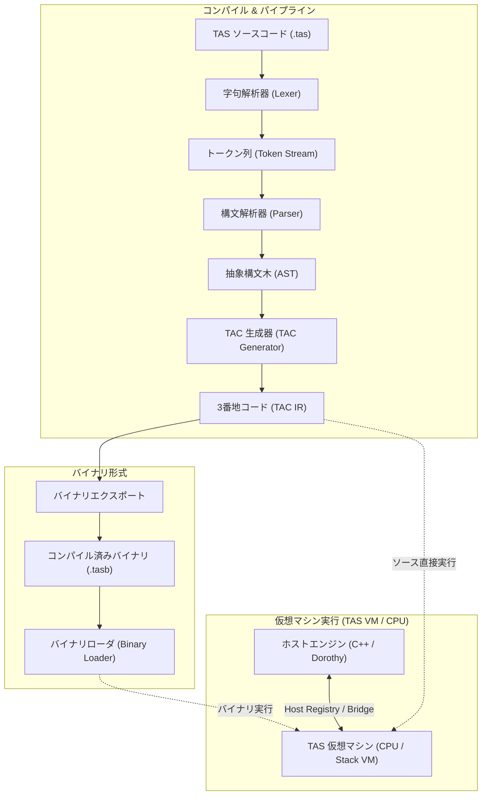
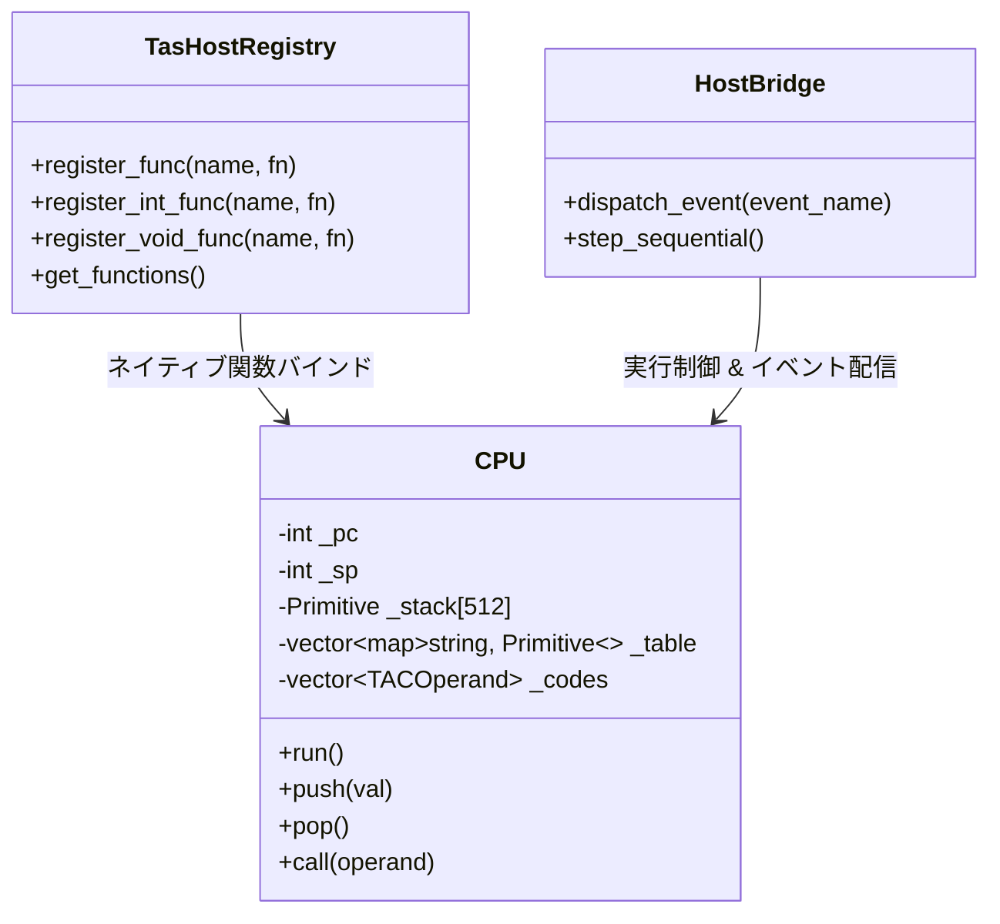
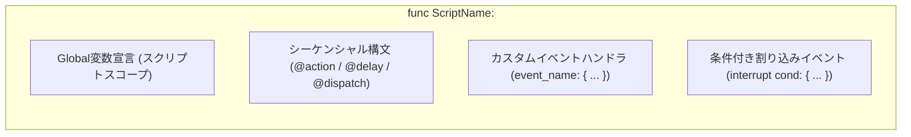
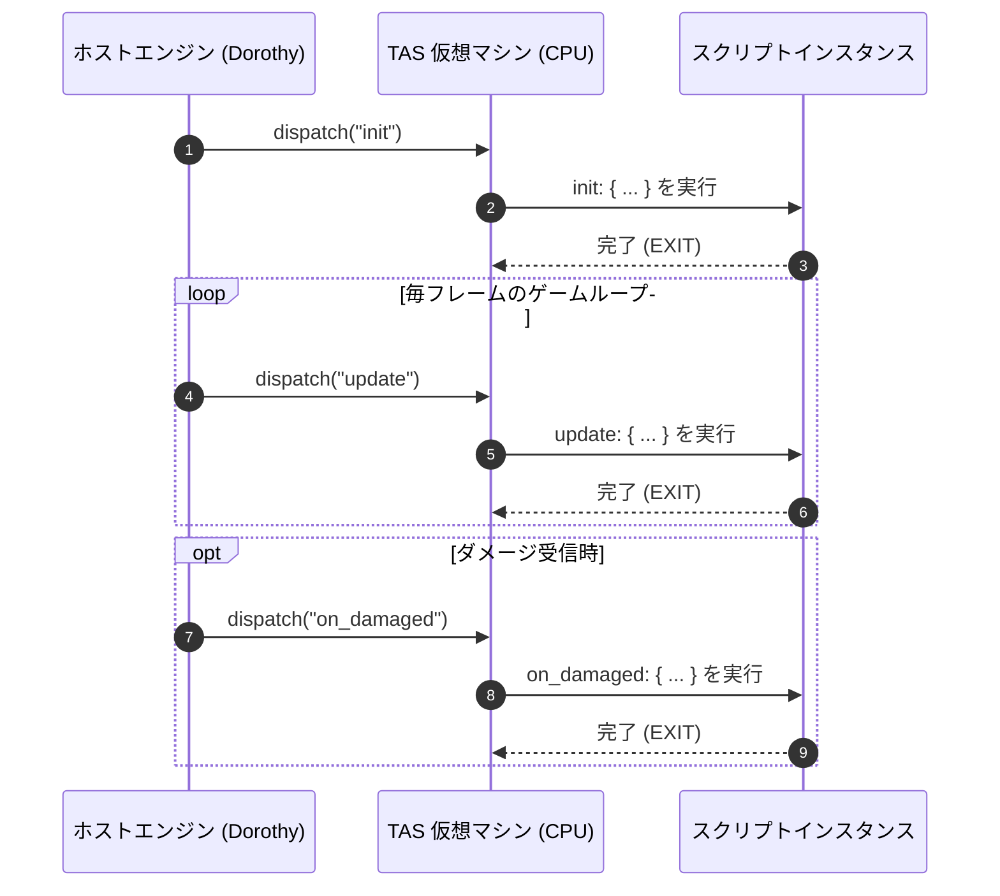
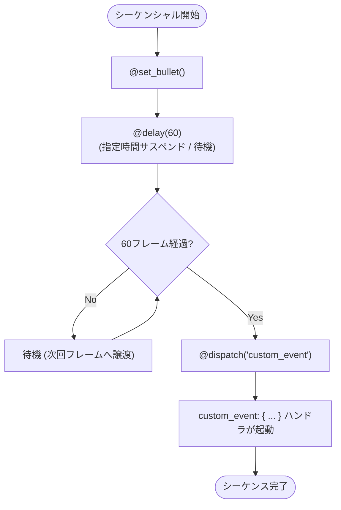
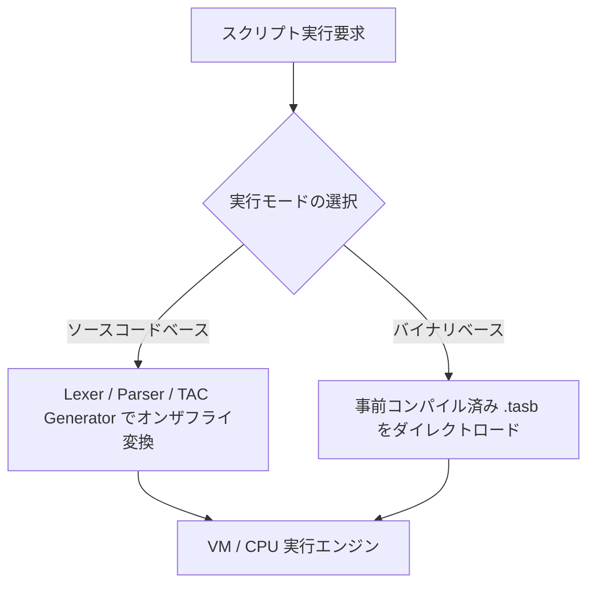

# Tombee Action Script (TAS) 言語仕様書 (Language Specification)

本書は、ゲームオブジェクトの振る舞い制御、エネミーAI、弾幕パターン、シーケンス演出のために設計されたスクリプト言語 **Tombee Action Script (TAS)** の完全な言語仕様書です。

---

## 1. 概要 (Overview)

Tombee Action Script (TAS) は、ゲームエンジン（Dorothy / C++）と緊密に連携する軽量・高応答な組み込みスクリプト言語です。以下の2つの実行モデルをシームレスに統合（ハイブリッド実行）してプログラミングを行うことができます。

1. **イベントドリブン（Event-Driven）**: ホストまたはスクリプト内部からのイベント覚知（ディスパッチ）によって該当ハンドラを実行
2. **シーケンシャル（Sequential）**: `@` 構文による時系列アクション、ディレイ待機、非同期イベント発行を順次実行

また、仮想マシン（VM / CPU）は**ソースコード直接実行（インタープリタ型）**と**コンパイル済みバイナリ実行（バイナリベース）**の双方をネイティブサポートします。

---

## 2. システムアーキテクチャ (System Architecture)

### 2.1 コンパイル & 実行パイプライン

TAS は、テキストソースコードからの即時パース実行と、事前コンパイルされたバイナリ（TAC Bytecode）の高速ロード実行の双方向に対応します。



### 2.2 ホスト連携アーキテクチャ (`tas_bridge`)

スクリプト側で実行されるネイティブ機能（描画、座標更新、弾丸生成、タイマー制御等）は、ホスト側の `TasHostRegistry` を介して登録されたネイティブ C++ 関数と相互通信します。



---

## 3. 実行モデル (Execution Models)

TAS は、**イベントドリブン構文**と**シーケンシャル構文**をサポートします。



---

### 3.1 イベントドリブン（Event-Driven）

外部（または内部）からイベントを覚知したときに処理が呼ばれることによって実行される構文です。

#### 構文規則
- イベントブロックは `<event_name>: { ... }` の形式で記述します。
- `init`、`update`、`render` などを含め、イベント名は**すべてカスタムイベント（予約語を持たない任意のASCII文字列、最大128文字）**として扱われ、任意の名称を設定できます。
- 条件付き割り込みイベント `interrupt <cond>: { ... }` のみ、条件式を伴う特殊構文として予約語 `interrupt` を持ちます。
- 関数名およびコマンド名はすべて**ローワースネークケース (`lower_snake_case`)** を使用します。

#### 記述例
```tas
func enemy_boss:
    var hp = 1000;

    // initイベントを受信すると、ここが実行される
    init: {
        set_position(400, 100);
        set_speed(2.5);
    }

    // updateイベントを受信すると、ここが実行される
    update: {
        rotate(5);
        if (hp <= 0) {
            destroy();
        }
    }

    // 任意のカスタムイベント
    on_damaged: {
        hp = hp - 10;
        flash_red();
    }

    // 条件付き割り込みイベント (hpが200未満になった時に割り込み実行)
    interrupt (hp < 200): {
        set_speed(5.0);
        spawn_shield();
    }
end
```

#### イベント実行シーケンス



---

### 3.2 シーケンシャル（Sequential）

`@` プレフィックスを付与したコマンド構文により、時系列に沿った一連のアクションを順次実行（同期／非同期待機・ステップ実行）します。

#### 構文規則
- コマンドは `@command_name(args...)` で記述します。
- コマンド名および関数名は**ローワースネークケース (`lower_snake_case`)** です。
- 文末のセミコロン `;` は省略可能です。
- アクション実行、待機、イベントディスパッチを順序通りに記述できます。

#### 記述例
```tas
func example_001:
    @set_bullet()
    @delay(60)
    @dispatch("custom_event")

    custom_event: {
        print("custom event executed");
    }
end
```

`set_bullet` -> `delay` (60ms/60フレーム待機) -> `dispatch` の順に実行されます。

#### シーケンシャル実行フロー



---

### 3.3 ハイブリッド連携

同一スクリプト内で「スクリプトレベルのGlobal変数」を共有し、シーケンシャル処理から `@dispatch` でイベントハンドラをトリガーしたり、イベントハンドラからシーケンス状態を更新するハイブリッド制御が可能です。

```mermaid
flowchart LR
    subgraph SharedMemory ["共有スコープ (Global変数)"]
        STATE["phase / score / is_alive"]
    end

    subgraph SequentialEngine ["シーケンシャル実行"]
        SEQ_CORO["@action() -> @delay() -> @dispatch('phase2')"]
    end

    subgraph EventHandler ["イベントハンドラ"]
        EV_HANDLER["phase2: { ... }"]
        EV_UPDATE["update: { ... }"]
    end

    SEQ_CORO -->|値の更新/参照| STATE
    EV_HANDLER -->|値の更新/参照| STATE
    EV_UPDATE -->|値の更新/参照| STATE
    SEQ_CORO -->|@dispatch| EV_HANDLER
```

---

## 4. 字句仕様 (Lexical Specification)

### 4.1 文字セット & 識別子・命名規則
- **文字セット**: ASCII 準拠
- **識別子 (Identifier)**: 
  - 半角英字およびアンダースコアで始まり、半角英数字およびアンダースコアが続く文字列。
  - 正規表現: `[a-zA-Z_][a-zA-Z0-9_]*`
  - **最大長制限**: 変数名、カスタムイベント名、関数名は **最大128文字**。
- **命名規則 (Naming Convention)**:
  - **関数名・コマンド名**: ローワースネークケース (`lower_snake_case`)
  - **変数名**: ローワースネークケース (`lower_snake_case`)
  - **イベント名**: ローワースネークケース (`lower_snake_case`)
  - **スクリプト名 (func ID)**: ローワースネークケース (`lower_snake_case`)

### 4.2 コメント & 空白
- **単一行コメント**: `//` から行末までをコメントとして無視します。
- **空白**: 半角スペース、タブ、改行コード（`\r`, `\n`）はトークンの区切りとして扱われ、構文上無視されます。

### 4.3 予約語 (Keywords)
以下の単語は予約語であり、識別子（変数名）として使用することはできません。

| 予約語 | 種別 | 説明 |
| :--- | :--- | :--- |
| `func` | 宣言 | スクリプト定義の開始 |
| `end` | 宣言 | スクリプト定義の終了 |
| `interrupt` | 構文 | 条件付き割り込みイベントブロック |
| `if` | 制御 | 条件分岐（真ブロック） |
| `else` | 制御 | 条件分岐（偽ブロック） |
| `loop` | 制御 | 回数指定ループ構文 |
| `int` | 型 | 32bit 符号付き整数型宣言 |
| `float` | 型 | 64bit 浮動小数点型宣言 |
| `var` | 型 | 動的型 / 型推論宣言 |
| `case` | 将来予約 | 条件選択構文用 |
| `shot` | 将来予約 | 弾幕専用構文用 |
| `ref` | 将来予約 | 参照型宣言用 |

> [!NOTE]
> `init`、`update`、`render` は**予約語ではありません**。任意のカスタムイベント名として扱われます。

### 4.4 リテラル (Literals)
- **整数リテラル (`int`)**: 10進数整数 (`0`, `42`, `-100`)
- **浮動小数点リテラル (`float`)**: 小数点を含む実数 (`0.0`, `3.14159`, `-0.5`)
- **文字列リテラル (`string`)**: ダブルクォーテーションで囲まれた文字列 (`"Hello, Dorothy!"`)

### 4.5 演算子 & 記号 (Operators & Punctuators)

| 分類 | 記号 |
| :--- | :--- |
| 算術演算子 | `+`, `-`, `*`, `/`, `%` |
| 比較演算子 | `==`, `!=`, `<`, `<=`, `>`, `>=` |
| 論理演算子 | `&&`, `||` |
| 単項演算子 | `-` (符号反転), `++` (インクリメント), `--` (デクリメント) |
| 代入演算子 | `=`, `+=`, `-=` |
| シーケンシャル記号 | `@` |
| 区切り記号・括弧 | `:`, `;`, `,`, `(`, `)`, `{`, `}` |

---

## 5. 文法および構文規則 (Grammar & Syntax Rules)

### 5.1 プログラム & スクリプト定義
1つのソースファイルには複数のスクリプト (`func`) を定義可能です。

```tas
func <script_name>:
    <Global変数宣言 / 文 / イベントブロック / シーケンシャルコマンド>...
end
```

### 5.2 変数宣言とスコープ規則

#### 1. Global変数（スクリプトスコープ）
`func <script_name>:` 直下で宣言された変数は、**そのスクリプト内全体（すべてのイベントハンドラおよびシーケンシャルコマンド）から共有・アクセス可能なGlobal変数**となります（スコープは `func` 〜 `end` 内）。

```tas
func boss_ai:
    int total_shots = 0;   // スクリプトレベルGlobal変数
    float speed = 3.5;

    init: {
        total_shots = 0;
    }

    update: {
        total_shots = total_shots + 1;
    }
end
```

#### 2. Local変数（ブロックスコープ）
イベントブロック `{ ... }`、条件分岐、ループなどのブロック内部で宣言された変数は、そのブロック内部のみ有効なローカルスコープを持ちます。

```tas
update: {
    int local_count = 10;  // このブロック内のみ有効
    loop (local_count) {
        var temp = get_target();
        fire(temp);
    }
}
```

### 5.3 型システム
| 型名 | C++ 内部型 | 説明 |
| :--- | :--- | :--- |
| `int` | `int32_t` | 整数型 |
| `float` | `double` | 倍精度浮動小数点型 |
| `string` | `std::string` | 文字列型 |
| `var` | `tas::Primitive` | 動的型（代入された値に応じて型が決定） |
| `none` | `void` | 値が存在しない状態 |

### 5.4 演算子の優先順位と結合則

| 優先度 | 演算子 | 結合規則 | 説明 |
| :---: | :--- | :---: | :--- |
| 1 (高) | `()`, `@`, 関数呼び出し | 左結合 | 括弧、コマンド、関数呼び出し |
| 2 | `++`, `--`, `-` (単項) | 右結合 | 前置単項演算子 |
| 3 | `*`, `/`, `%` | 左結合 | 乗除・剰余演算 |
| 4 | `+`, `-` | 左結合 | 加算・減算 |
| 5 | `<`, `<=`, `>`, `>=` | 左結合 | 関係比較演算 |
| 6 | `==`, `!=` | 左結合 | 等価比較演算 |
| 7 | `&&` | 左結合 | 論理積 |
| 8 | `\|\|` | 左結合 | 論理和 |
| 9 (低) | `=`, `+=`, `-=` | 右結合 | 代入演算 |

### 5.5 制御構文

#### 条件分岐 (`if` - `else`)
```tas
if (cond) {
    // 真の場合の文
} else {
    // 偽の場合の文（省略可能）
}
```

#### 回数指定ループ (`loop`)
`loop (式)` は指定された整数回数だけブロック内の処理を反復します。
```tas
loop (10) {
    spawn_enemy();
}
```

---

## 6. 中間表現 (TAC) & 仮想マシン (CPU / VM) 仕様

### 6.1 実行方式サポート

TAS の仮想マシンは以下の2つのロード/実行方式をネイティブにサポートします。



1. **ソースコードベース実行**:
   - スクリプトファイルを直接読み込み、実行時にオンザフライで TAC を生成して即座に実行。
   - 開発時の迅速なイテレーション、ホットリロードに最適。
2. **バイナリベース実行**:
   - 事前にビルドされた中間バイナリファイル（`.tasb`）をロードして実行。
   - パース処理をスキップできるため、起動オーバーヘッドの極小化とソースコード秘匿が可能。

---

### 6.2 3番地コード (TAC) 命令セット

仮想マシンはスタックベースの TAC (Three Address Code) を順次解釈・実行します。

| オペコード | ニーモニック | 説明 |
| :--- | :--- | :--- |
| `-1` | `EXIT` | スクリプトまたはイベント実行の終了 |
| `0` | `NEXT` | 次の命令へ進む |
| `1` | `PUSH` | 指定した定数または変数をスタックへプッシュ |
| `2` | `POP` | スタックトップの値を破棄 |
| `3` | `DECL` | 現在のスコープに変数を宣言 |
| `4` | `ASSIGN` | スタックから変数名と値を取り出し代入 |
| `5` | `EQ` | 等価比較 (`p2 == p1`) |
| `6` | `NE` | 不等比較 (`p2 != p1`) |
| `7` | `LT` | 小なり比較 (`p2 < p1`) |
| `8` | `LE` | 以下比較 (`p2 <= p1`) |
| `9` | `GT` | 大なり比較 (`p2 > p1`) |
| `10` | `GE` | 以上比較 (`p2 >= p1`) |
| `11` | `ADD` | 加算演算 (`p2 + p1`) |
| `12` | `SUB` | 減算演算 (`p2 - p1`) |
| `13` | `MUL` | 乗算演算 (`p2 * p1`) |
| `14` | `DIV` | 除算演算 (`p2 / p1`、ゼロ除算保護あり) |
| `15` | `MOD` | 剰余演算 (`p2 % p1`) |
| `16` | `REV` | スタックトップの値の符号を反転 (`-val`) |
| `17` | `LOAD` | スタックトップの変数名から値を解決してプッシュ |
| `18` | `CALL` | ホスト関数の呼び出し |
| `19` | `JE` | スタックトップが真 (非0) の場合ジャンプ |
| `20` | `JNE` | スタックトップが偽 (0) の場合ジャンプ |
| `21` | `JMP` | 無条件ジャンプ |
| `22` | `STAGED` | 新しいローカルスコープを開く |
| `23` | `UNSTAGED` | ローカルスコープを閉じる |
| `24` | `LOOPSTART` | ループカウンタをスタックから取得しループスタックへ登録 |
| `25` | `LOOPEND` | ループカウンタを減算し、残りがあれば先頭へジャンプ |

---

## 7. ホスト連携仕様 (`tas_bridge`)

C++ ゲームエンジンから TAS を呼び出すための標準インターフェース仕様です。関数バインド名もローワースネークケースを標準とします。

```cpp
#include "tas_bridge.hpp"

// 1. ホスト関数の登録
tas_bridge::TasHostRegistry::global().register_void_func("set_speed", [](void* context, double speed) {
    auto* enemy = static_cast<Enemy*>(context);
    enemy->setSpeed(speed);
});

// 2. スクリプトの実行 (イベントディスパッチ)
tas::CPU vm;
vm.reserve(tas_bridge::TasHostRegistry::global().get_functions());
vm.set(enemy_instance);

// "init" イベントの実行
// vm.start(entry_point_init);
// vm.run();
```

---

## 8. スクリプト記述サンプル (Examples)

### サンプル 1: ボスエネミーのハイブリッド制御
```tas
func boss_character:
    // Global変数の宣言
    int hp = 500;
    float base_angle = 0.0;

    init: {
        set_position(320, 240);
        set_texture("boss.png");
    }

    update: {
        base_angle = base_angle + 2.0;
        if (hp <= 0) {
            @dispatch("on_defeat")
        }
    }

    // シーケンシャルな弾幕ルーチン
    @delay(60)
    @loop(3) {
        @fire_radial(base_angle, 12)
        @delay(20)
    }
    @dispatch("phase_shift")

    phase_shift: {
        flash_color(255, 0, 0);
        print("boss enters enraged mode!");
    }

    on_defeat: {
        spawn_explosion();
        destroy();
    }

    // HP低下時の割り込み
    interrupt (hp < 150): {
        set_speed(6.0);
    }
end
```
